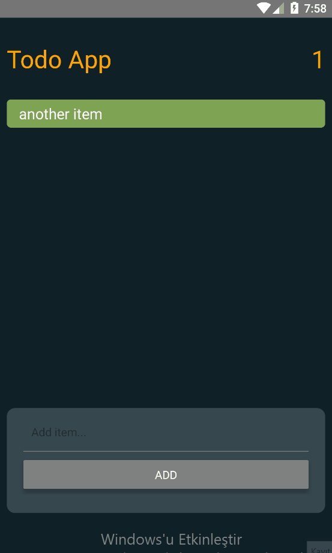

# kodluyoruz-react-native

Kodluyoruz Eğitimi kapsamında açtığım react native ile ilgili repo

<table>
    <tr>
        <td>
            <a href="https://github.com/Mr-Mesut-OZTURK/kodluyoruz-react-native/tree/main/src/music-app" target="_blank">## MUSİC APP</a>
        </td>
        <td>
            
        </td>
    </tr>
    <tr>
        <td>
            <a href="https://github.com/Mr-Mesut-OZTURK/kodluyoruz-react-native/tree/main/src/todo-app" target="_blank">## TODO APP</a>
        </td>
        <td>
            
        </td>
    </tr>
    <tr>
        <td>
            <a href="#">##</a>
        </td>
        <td>
            
        </td>
    </tr>
</table>

