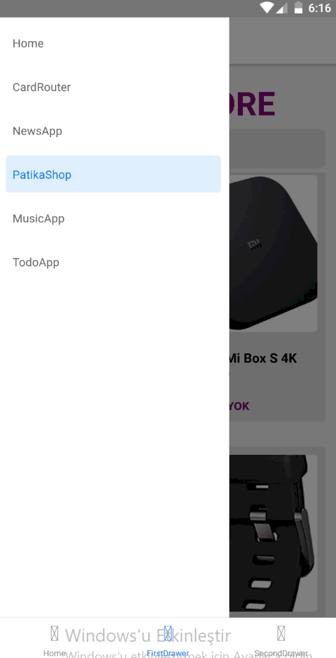

# kodluyoruz-react-native

Kodluyoruz Eğitimi kapsamında açtığım react native ile ilgili repo

<table>
    <tr>
        <td>
            <a href="https://github.com/Mr-Mesut-OZTURK/kodluyoruz-react-native/tree/main/src/first-week/music-app" target="_blank">## MUSIC APP</a>
        </td>
        <td>
            
        </td>
    </tr>
    <tr>
        <td>
            <a href="https://github.com/Mr-Mesut-OZTURK/kodluyoruz-react-native/tree/main/src/first-week/patika-shop" target="_blank">## PATIKA SHOP</a>
        </td>
        <td>
            
        </td>
    </tr>
    <tr>
        <td>
            <a href="https://github.com/Mr-Mesut-OZTURK/kodluyoruz-react-native/tree/main/src/first-week/todo-app" target="_blank">## TODO APP</a>
        </td>
        <td>
            
        </td>
    </tr>
    <tr>
        <td>
            <a href="https://github.com/Mr-Mesut-OZTURK/kodluyoruz-react-native/tree/main/src/second-week/dukkan-app" target="_blank">## DUKKAN APP</a>
        </td>
        <td>
            
        </td>
    </tr>
    <tr>
        <td>
            <a href="https://github.com/Mr-Mesut-OZTURK/kodluyoruz-react-native/tree/main/src/second-week/tarifka" target="_blank">## TARIFKA APP</a>
        </td>
        <td>
            
        </td>
    </tr>
</table>
